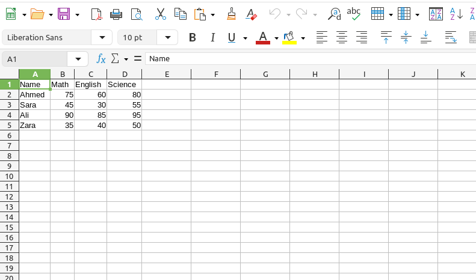
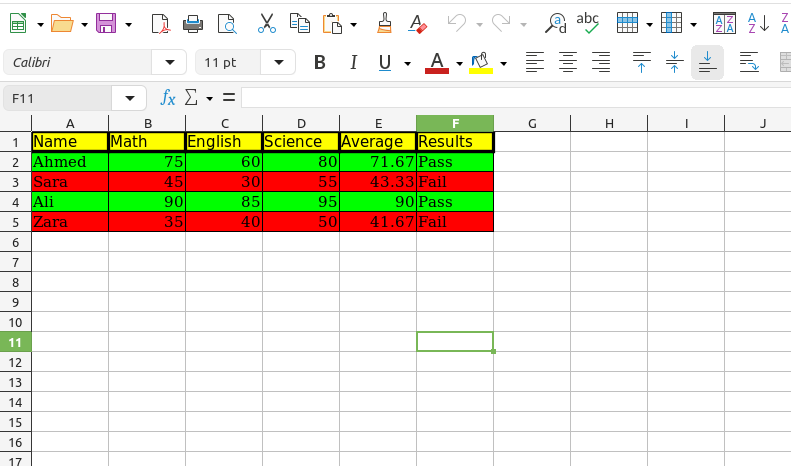

# 🎓 Student Result Analyzer

A Python tool that reads student marks from a CSV file and generates a professional color-coded Excel report automatically.

Built with **Python**, **Pandas**, and **openpyxl**.

---

## 🖥️ Output Preview




---

## ✨ Features

- Reads student marks from CSV file
- Auto-calculates average for each student
- Pass/Fail decision based on average
- Color-coded output — Green = Pass, Red = Fail
- Professional borders and formatting
- Yellow header row for clarity

---

## 📦 Requirements

```bash
pip install pandas openpyxl
```

---

## 🚀 How to Use

1. Clone the repository:
```bash
git clone https://github.com/abdullahautomation/student-result-analyzer.git
```

2. Add your CSV file in this format: