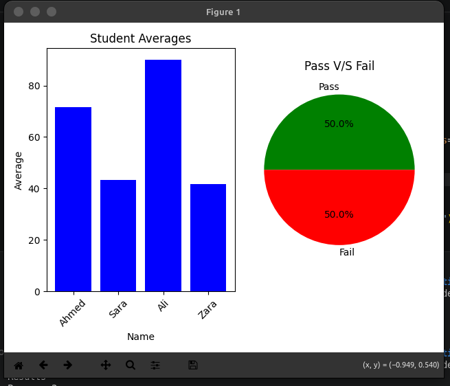

# 🎓 Student Result Analyzer

A Python tool that reads student marks from a CSV file and automatically generates a professional, color-coded Excel report with visual charts.

Built with **Python**, **Pandas**, **openpyxl**, and **Matplotlib**.

---

## 🖥️ Output Preview




---

## ✨ Features

- Reads student marks from any CSV file
- Auto-calculates average marks for each student
- Pass/Fail decision based on average (50% passing criteria)
- Color-coded output — 🟢 Green = Pass, 🔴 Red = Fail
- Professional borders and formatting
- Yellow header row for clarity
- 📊 Visual charts — Bar chart (averages) + Pie chart (Pass/Fail ratio)

---

## 📦 Requirements

Install dependencies using pip:

```bash
pip install pandas openpyxl matplotlib
```

---

## 🚀 How to Use

1. Clone the repository:
```bash
git clone https://github.com/abdullahautomation/student-result-analyzer.git
```

2. Navigate to the project folder:
```bash
cd student-result-analyzer
```

3. Prepare your CSV file in this format:
```
Name,Math,English,Science
Ahmed,75,60,80
Sara,45,30,55
Ali,90,85,95
Zara,35,40,50
```

4. Run the script:
```bash
python script.py
```

5. Your Excel report will be saved as `output_results.xlsx` ✅
6. Charts will appear automatically in a new window 📊

---

## 📁 Project Structure

```
student-result-analyzer/
│
├── script.py           # Main Python script
├── students.csv        # Sample input file
├── output_results.xlsx # Generated Excel report
├── README.md           # Project documentation
└── screenshots/        # Output previews
    ├── messy.png       # Raw CSV data
    ├── clean.png       # Formatted Excel output
    └── charts.png      # Visual charts output
```

---

## 🛠️ Built With

- [Python](https://www.python.org/)
- [Pandas](https://pandas.pydata.org/)
- [openpyxl](https://openpyxl.readthedocs.io/)
- [Matplotlib](https://matplotlib.org/)

---

## 👨‍💻 Author

**Abdullah**
🔗 [GitHub](https://github.com/abdullahautomation)
🌐 [Fiverr](https://www.fiverr.com/abdullah7514)

---

## 📃 License

This project is open source and available under the [MIT License](LICENSE).